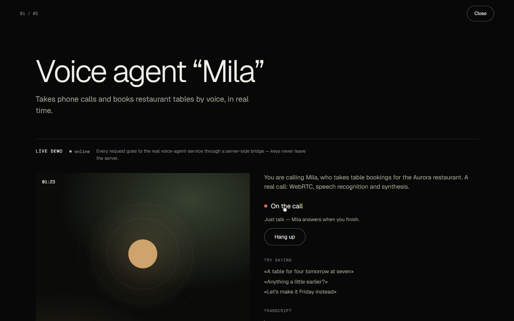

# voice-agent-service (русская версия)

*[English version](README.md)*

Настоящий голосовой агент на **LiveKit**, который бронирует столики в ресторане по телефону.
Персона — **Мила**, администратор вымышленного ресторана: слышит, говорит и вызывает строго
типизированные инструменты, чтобы проверить наличие мест и оформить бронь в
[`ops-core-api`](https://github.com/upkero/ops-core-api). Это полноценный WebRTC-пайплайн (LiveKit-транспорт,
потоковый STT → LLM → TTS, детерминированный tool-calling), а не имитация через браузерный
Web Speech API.



*Живое демо: настоящий звонок Миле через WebRTC.*

**Offline-first:** распознавание речи (faster-whisper) и синтез (piper) работают локально, LiveKit
поднимается в dev-режиме. Для `docker compose up` **не нужен ни облачный аккаунт, ни ключ для
речи** — только ключ того экземпляра ops-core-api, где лежат данные бронирований.

## Что делает

| Возможность | Детали |
|---|---|
| Голосовой пайплайн | LiveKit WebRTC, Silero VAD, STT → LLM → TTS через `AgentSession`. |
| Детерминированные инструменты | Четыре function-tool со строгой JSON Schema и валидацией Pydantic до вызова — ослышка не приводит к брони. |
| Бронирование | Проверка наличия, ближайшие реальные слоты, бронь, поиск и отмена — всё через HTTP к ops-core-api. При брони Мила между делом называет четырёхзначный код; бронь с прошлого звонка отменяется по имени, дате и этому коду (имя и дата угадываются и ничего не доказывают). Код нигде не хранится — это HMAC от id брони на ключе `OPS_CORE_API_KEY`; три неверных кода за звонок — и проверка кода прекращается. |
| Двуязычность | `AGENT_LANGUAGE=ru\|en` переключает подсказку Whisper, голос piper и персону одной настройкой. |
| Грациозная деградация | Недоступность ops-core-api или исчерпанная цепочка fallback'ов STT/TTS даёт голосовое или текстовое объяснение — не тишину. |

Два процесса в одном репозитории:

1. **HTTP API** (`src/main.py`) — тонкий сервер токенов: `GET /health/*` и `POST /token`,
   возвращающий LiveKit-JWT, чтобы браузер подключился к комнате напрямую через WebRTC. Бизнес-логики
   бронирования тут нет.
2. **Agent worker** (`src/entrypoint.py`) — сам голосовой агент: подключается к комнате, крутит
   пайплайн и отдаёт инструменты бронирования модели.

## Архитектура

Слоистая, строгое правило зависимостей внутрь. Два слоя доставки (`api/v1/` и `voice/`), потому что
это два процесса; нет `models/` и `db/`, потому что своей базы нет — единственный источник данных
ops-core-api. Подробно и таблица паттернов — в [`docs/architecture.md`](docs/architecture.md).

| Паттерн | Где |
|---|---|
| **Adapter** | HTTP-клиент к ops-core-api за портом `BookingGateway`; локальная модель/бинарь за STT/TTS livekit. |
| **Factory** | По одному конструктору на диалоговый LLM, STT- и TTS-клиент — провайдер выбирается настройками. |
| **Strategy** | Ранжирование слотов (ближайшее время / раньше всех), внедряется в `ReservationService`. |
| **Template Method** | Системный промпт диалога: фиксированный порядок секций, переопределяемые шаги. |

## Быстрый старт

```bash
cp .env.example .env
# укажите OPS_CORE_API_KEY — ключ вашего ops-core-api
docker compose up --build
```

Плейсхолдер `OPS_CORE_API_KEY=change-me-min-16-chars` одинаков во всех пяти сервисах портфолио,
поэтому свежий `cp .env.example .env` даёт рабочее демо. Ротируйте его сразу во всех пяти: один
отставший сервис отвечает 401 на каждый вызов.

Поднимаются три контейнера: `livekit` (dev-режим, пара `devkey`/`secret`), `voice-api` (порт 8080,
токены и health) и `voice-agent` (голосовой воркер, регистрируется в LiveKit и ждёт звонка). Образ агента
на этапе сборки вшивает бинарь piper, оба голоса и модель Whisper, поэтому холодный старт ничего не
качает.

Все порты опубликованы только на `127.0.0.1`, и это намеренно: `--dev` использует общеизвестную пару
`devkey`/`secret`, и любой, кто достучится до 7880, подпишет себе токен LiveKit (вплоть до админского) и
подключится к любому звонку. Только для локального запуска; в общей сети с dev-ключами стек не открывать.

**Дополнительно нужны LLM и бэкенд бронирований:**

- **ops-core-api** — запустите из его папки (`git clone https://github.com/upkero/ops-core-api && cd ops-core-api && docker compose up -d`). Если он
  недоступен, демо всё равно подключается, и Мила объясняет проблему голосом — это и есть проверка
  деградации вживую.
- **LLM с tool-calling** — по умолчанию `.env` смотрит на локальный Ollama (`qwen2.5:7b`). Можно
  направить `LLM_*` на любой OpenAI-совместимый эндпоинт.

## Эндпоинты и подключение

`/health/ready` проверяет только LiveKit — ни воркер, ни ops-core-api он не видит (недоступный ops-core —
это голосовая деградация, а не «не готов»). У воркера свой Docker `HEALTHCHECK` на встроенный `:8081/`
livekit-agents, у всех сервисов `restart: unless-stopped`.

`POST /api/v1/token` (см. curl в английской части) возвращает JWT, `livekit_url` и новое случайное имя комнаты
`booking-…`: комнату всегда генерирует сервер, `room_name` из запроса игнорируется. Необязательное поле `language` (`ru|en`) задаёт язык звонка,
иначе берётся `AGENT_LANGUAGE`; приветствие фиксированное, синтезируется один раз при старте воркера. Готового
веб-клиента в репозитории нет — демо будет жить на сайте-портфолио. Прямо сейчас подключиться проще
всего через [LiveKit Agents Playground](https://agents-playground.livekit.io): вставьте `livekit_url`
и `token`, подключитесь и скажите *«стол на четверых завтра в семь вечера»* (при `AGENT_LANGUAGE=ru`).
Мила поздоровается, вызовет `check_availability`, предложит ближайшие реальные слоты, повторит выбор
и вызовет `create_booking` после подтверждения — бронь появится в ops-core-api.

## Настройка речи (STT и TTS независимы)

Распознавание и синтез — два раздельных порта с раздельными блоками настроек. Поддерживается любая
комбинация: локальное распознавание с облачным голосом или наоборот. **Стриминговый провайдер или
батчевый — в коде приложения нигде не ветвление:** каждый клиент объявляет свою capability, а
`AgentSession` сама оборачивает батчевый в свой VAD-сегментатор.

| `STT_PROVIDER` | Режим | Задержка после реплики | Что нужно |
|---|---|---|---|
| `faster_whisper` | батч, локально | ~1-2с (CPU) | ничего — офлайн-умолчание |
| `openai_compatible` | батч REST | ~2с на фрагмент | `STT_BASE_URL` / `STT_API_KEY` / `STT_MODEL` |
| `deepgram` | **стриминг** | ~150-300мс | ключ Deepgram в `STT_API_KEY`, `STT_MODEL=nova-3` |
| `whisper_stream` | **стриминг** | ~1с на GPU | `STT_WHISPER_STREAM_URL` → свой WhisperLive |

| `TTS_PROVIDER` | Режим | Первый байт | Что нужно |
|---|---|---|---|
| `piper` | локально | ~150мс | ничего — офлайн-умолчание |
| `openai_compatible` | батч REST | ~2-3с | `TTS_BASE_URL` / `TTS_API_KEY` / `TTS_MODEL` / `TTS_VOICE` |
| `cartesia` | **стриминг** | ~90мс | ключ Cartesia в `TTS_API_KEY`, `TTS_MODEL=sonic-2`, свой `TTS_VOICE` |

Облачные клиенты не привязаны к провайдеру: конкретный сервис выбирает `*_BASE_URL` (OpenRouter,
OpenAI, свой сервер с OpenAI-совместимым audio-API), а не код. Провайдер **без** OpenAI-совместимого
контракта (например Cartesia) — это отдельная реализация того же порта `TTSClient` плюс одна ветка в
`llm/tts_factory.py`, по Open/Closed; в остальном коде не меняется ничего.

### Fallback включён по умолчанию

`STT_FALLBACK_PROVIDER` по умолчанию `faster_whisper`, `TTS_FALLBACK_PROVIDER` — `piper`. Оба вшиты
в образ агента, работают офлайн и ничего не стоят, поэтому достаточно поставить облачного провайдера
в `STT_PROVIDER` / `TTS_PROVIDER`: пара автоматически заворачивается в `FallbackAdapter`, и сбой
Deepgram или Cartesia превращается в более медленный ответ, а не в проблему гостя. Fallback, равный
основному провайдеру, игнорируется; пустое значение отключает его совсем.

### Свой стриминговый STT

`whisper_stream` работает с сервером [WhisperLive](https://github.com/collabora/WhisperLive): это
настоящий стриминг (скользящий буфер + LocalAgreement, контекст переживает границы фрагментов).
Сервер — **сервис-сосед, доступный по URL**, той же формы, что и ops-core-api:

```bash
docker compose --profile selfhost-stt up   # WhisperLive на ws://whisper:9090
# затем: STT_PROVIDER=whisper_stream, STT_WHISPER_STREAM_URL=ws://whisper:9090
```

В продакшене он переезжает на свою GPU-машину без изменений в коде — меняется только URL.

## Как ведёт себя деградация

| Отказ | Что получает гость |
|---|---|
| ops-core-api недоступен / 5xx | Произнесённая фраза («не могу заглянуть в журнал — попробуйте через несколько минут или позвоните администратору»). Обратный звонок не обещается: номер записать некуда. В пайплайн исключение не уходит. |
| ops-core-api тормозит или висит | «Секунду, проверяю» сразу при вызове инструмента; через `AGENT_TOOL_WAIT_SECONDS` (8 с) суммарно, с ретраями, — фраза о недоступности выше. |
| Отказал TTS | Текст ответа уходит в data-канал комнаты, о проблеме сообщается один раз. Сессия жива. |
| Отказал STT | Мила говорит, что не слышит (TTS ещё работает); текстовый ввод включён, так что тот же цикл LLM + инструментов работает набором с клавиатуры. |
| Не поднялась сама сессия | Джоб падает, комната закрывается. Последняя фраза успевает уйти в data-канал, но текстового запасного пути здесь нет: `text_enabled` — параметр *сессии*, и сессия, которая не стартовала, не примет и текст. |

Про STT и TTS сказано «отказал» в точном смысле: сообщение уходит, только когда `FallbackAdapter`
перебрал всех настроенных провайдеров и livekit пометил ошибку как невосстановимую. На первом
транзиентном сбое Мила молчит и продолжает работать.

## Docker Desktop и прод

Браузер на хосте не может достучаться до IP контейнера, поэтому `config/livekit.yaml` включает
`rtc.enable_loopback_candidate: true`: LiveKit объявляет ещё и `127.0.0.1` (UDP 7882 и TCP 7881), а агент
внутри compose продолжает ходить на адрес контейнера. Если UDP закрыт, звонок идёт по TCP 7881 через тот
же loopback. **Это только для локального запуска:** для прода нужен публичный `wss://` (TLS перед 7880,
отдаётся браузеру через `PUBLIC_LIVEKIT_URL`), публичный IP сервера или TURN и своя пара ключей LiveKit
вместо `--dev`.

## Тесты

```bash
uv sync && uv run ruff check . && uv run mypy src
uv run pytest --cov=src/app/services --cov-report=term-missing
```

165 тестов, ~97% покрытия слоя services. Ни базы, ни сети: порт `BookingGateway` заменяется
in-memory фейком (его вторая реализация), так что весь набор идёт офлайн. CI гоняет те же команды на
каждый push.
